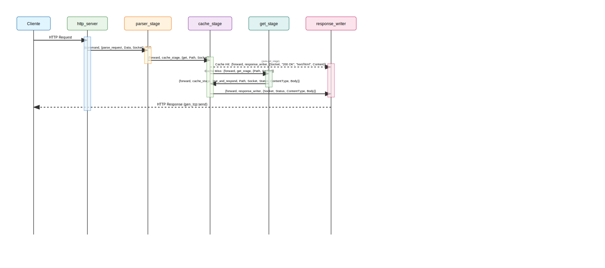

# Projeto SEDA Erlang

Este projeto implementa um servidor web baseado no padrão SEDA (Staged Event-Driven Architecture) em Erlang. O processamento de requisições HTTP é dividido em estágios independentes, cada um com múltiplos workers, promovendo concorrência, isolamento e escalabilidade.

## Visão Geral

- **http_server**: Aceita conexões TCP e repassa os dados recebidos para o próximo estágio.
- **http_parser_stage**: Faz o parsing da requisição HTTP e encaminha para o estágio responsável pelo recurso solicitado.
- **get_stage**: Lê arquivos do diretório `www/` e responde ao cliente com o conteúdo ou erro 404.
- **stage_behaviour**: Behaviour Erlang criado para encapsular a lógica de um estágio do padrão SEDA (Staged Event-Driven Architecture), incluindo controle de workers, balanceamento e passagem de mensagens entre estágios.
- **stage_controller**: Controlador do SEDA responsável por gerenciar o pool de processos (workers) de cada estágio, podendo adicionar ou remover workers dinamicamente conforme a necessidade do sistema.

## Arquitetura e Fluxo de Processamento



## Como compilar e rodar o projeto

1. **Compile o projeto:**
   ```sh
   rebar3 compile
   ```
2. **Inicie o shell Erlang:**
   ```sh
   rebar3 shell
   ```
3. O servidor estará ouvindo em `localhost:8080`.

## Teste de carga

Use o script em `load-tests/test-script.js` com o [k6](https://k6.io/):

```sh
k6 run load-tests/test-script.js
```

## Observações
- Cada estágio possui múltiplos workers, escolhidos aleatoriamente para balancear a carga.
- O projeto segue o padrão SEDA, facilitando a escalabilidade e a manutenção.
 